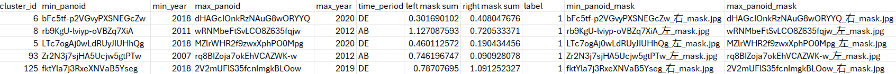

# Urban Change Detection
## Repository Structure
```
├── README.md
├── data
│   ├── data_preprocess_mem.py
│   ├── data_preprocess_nyc.py
│   ├── sample_data_nyc.png
|   ├── streetscape_dataset_mem.py
│   └── streetscape_dataset_nyc.py
├── models
│   ├── l2_pooling.py
│   └── model.py
├── test_mem.py
├── test_nyc.py
├── train_mem.py
├── train_nyc.py
└── requirement.txt
```

## Run NYC data
### data/data_preprocess_nyc.preprocess
- **input**: dataframe, mask paths, image paths
- **sample dataframe**: 
- **purpose**: confirm and store full paths of images and masks, split the data to training and validation sets
- **return**: training dataframe, validation dataframe

### train_nyc.train
- **input**: training dataframe, validation dataframe, number of epochs, if to resize images
- **recommendation**: resize images to speed up
- **return**: training loss, training accuracy, validation loss, validation accuracy, trained model

### test_nyc.test
- **input**: test dataframe, saved model, if to resize images
- **recommendation**: resize images to speed up
- **return**: accuracy